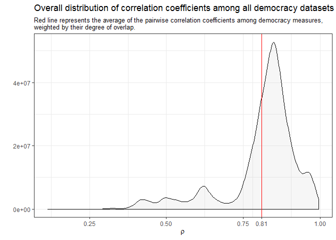
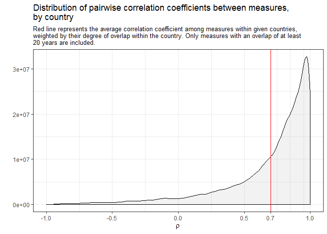
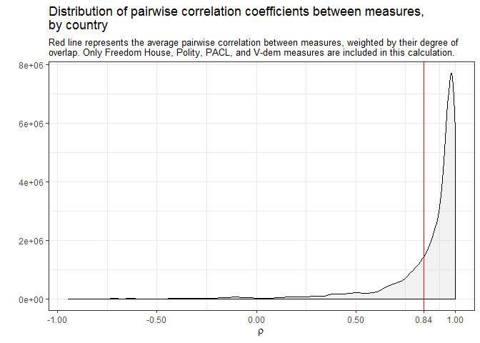

The quantification of power: some thoughts on, and tools for, measuring democracy
================
Xavier Marquez
26 September 2017

(More substantive content soon! This is mostly of interest to political scientists, `R` users, and people concerned with the measurement of democracy).

Democracy is the government of numbers. No other form of government has historically been as concerned with the quantification of power. Indeed, the idea that power depends on the *exact* numerical strength of one's supporters, rather than their qualities, would have seemed absurd for most of human history. And I would guess no other form of government has evoked so much mathematical effort. (Even the recent election here in NZ produced [extraordinarily sophisticated Bayesian models to predict the outcome](http://ellisp.github.io/elections/combined.html)).

And yet because the concept of democracy uneasily mingles what is, what can be, and what ought to be, people often object to the attempt to quantify its degree (or even its existence) in particular places and times. (My students often do!). Democracy does not seem like the kind of thing that would be easily and uncontroversially measurable. On the contrary, because [any attempt to measure democracy reflects certain normative standards](https://www.researchgate.net/profile/David_Altman2/publication/232026394_Conceptualizing_and_Measuring_Democracy_A_New_Approach/links/0046351dc942b01fdb000000/Conceptualizing-and-Measuring-Democracy-A-New-Approach.pdf), it cannot but be controversial, especially since most of its conceptualizations for such purposes tend to reduce it to competitive elections with a wide suffrage, which for a variety of reasons seems like an unacceptably narrow view of the ideal to many people.

This is most obvious when we're talking about cases like Venezuela, where to take a position on the question -- to say "Venezuela is a democracy" or "Venezuela is not a democracy" -- is [to take sides in a rancorous political dispute](http://www.annualreviews.org/doi/pdf/10.1146/annurev-polisci-072314-113326). But even to say something relatively uncontroversial, like "the United States is a consolidated democracy", is fraught with normative implications, since clearly "actually existing democracies" (representative governments with non-Potemkin opposition parties and nearly universal suffrage) are highly imperfect, and to give them top scores in some scale seems to imply that they are better than they truly are. In any case, although most people around the world [accept democracy as the only legitimate form of government](http://abandonedfootnotes.blogspot.com/2015/06/what-do-people-think-of-democracy.html), they disagree enormously about whether or not a given place is or is not actually democratic, and the degree to which particular practices and institutions "matter" for democracy.

Democracy measurement, then, is a somewhat dubious enterprise. The [essential contestability](https://www.jstor.org/stable/4544562) of the concept (is democracy about equality, or about self-government, or about freedom? In what proportions?), as well as good-faith differences of opinion about the sorts of preconditions that are essential for its functioning and the kinds of institutions that actualize its values, make it difficult to take seriously any single measurement of "democraticness." And these disagreements are not really resolvable by appeal to the dictionary; they go back [to the earliest discussions of democracy as a distinct phenomenon](https://www.bloomsbury.com/uk/democratic-moments-9781350006164/) in history.[1]

Yet I still think the attempt to summarize in some disciplined way particular judgments about "democraticness" over time and in space is useful. A democracy measure seems to me to be a numerical crystalization of a political history: a history at a (literal) glance that can be put to use to say more interesting things about the world. One need not agree with any particular conceptualization of democracy, or take any given measure as a normative standard of what democracy should be, to appreciate the possibility of historical comparison across time and space. And because the concept of democracy is inescapably contested, I think the more the merrier: let a hundred measures of democracy bloom, let a thousand schools of thought contend!

I am thus pleased to announce three different `R` packages (or rather, two and one update) for accessing and manipulating all the democracy datasets I know about:

1.  A package to access the [Varieties of Democracy (V-Dem) dataset](https://xmarquez.github.io/vdem), version 7.1 (the latest update). The V-Dem dataset is the gold standard of democracy measurement today. It provides indexes targeting multiple conceptualizations of democracy, and an extremely wide variety of indicators that you can use to satisfy basically every measurement need that you might have; if you don't like their particular conceptualizations of democracy, you can basically build your own. Each country is coded by at least five people, all of whom are live there, and subject to rigorous aggregation and validation procedures. Plus, it is annually updated, and covers the entire period 1900-2016, so it's pretty comprehensive. If you do any serious empirical research that requires you to use measures of democracy, you should seriously consider using V-Dem as your first choice of measure. This package allows you to access the entire V-Dem dataset (more than 3,000 variables, including external ones) directly from `R`, and to extract combinations of columns easily according to particular criteria (e.g., section of the codebook where they appear, label, etc.). Check it out at <https://xmarquez.github.io/vdem>, and install it using `devtools::install_github("xmarquez/vdem")`.

2.  A [package to download or access most other democracy datasets](https://xmarquez.github.io/democracyData) used in scholarly work from `R`, including [Polity IV](http://www.systemicpeace.org/polityproject.html), [Freedom House](https://freedomhouse.org/report-types/freedom-world), [Geddes, Wright, and Frantz's Autocratic Regimes dataset](http://sites.psu.edu/dictators/), the World Governance Indicators' "[Voice and Accountability](http://info.worldbank.org/governance/wgi/#home)" index, the [PACL/ACLP/DD dataset](https://sites.google.com/site/joseantoniocheibub/datasets/democracy-and-dictatorship-revisited), and many others, including some which are now of merely historical interest. (There are 32 of them in the package). The package automates the process of putting these datasets in standard country-year format, assigning appropriate country codes, and the like, and makes it easy to access some less well-known democracy datasets. (Mostly I created it because I've spent hundreds of hours tediously repeating these operations!). Check it out at <https://xmarquez.github.io/democracyData>, and install it using `devtools::install_github("xmarquez/democracyData")`.

3.  Finally, I've also updated my [package to replicate and extend the Unified Democracy scores](https://xmarquez.github.io/QuickUDS). (I first described this package [on this blog](http://abandonedfootnotes.blogspot.com/2016/03/artisanal-democracy-data-quick-and-easy.html)). This produces a latent variable index from multiple democracy measures, based on methods discussed by [Pemstein, Meserve, and Melton in 2010](http://www.unified-democracy-scores.org/); the most recent update of the package extendes these scores up to 2016 and incorporates revisions and updates of a variety of datasets, including Polity IV, Freedom House, and V-Dem It also includes improvements to the functions used to calculate UDS-style models. Check it out at <https://xmarquez.github.io/QuickUDS>, and install it using `devtools::install_github("xmarquez/QuickUDS")`.

Feedback, contributors, and pull requests for any of these packages welcome; I hope to be able to submit at least 2 of these packages to [CRAN](https://cran.r-project.org/) in the near future, so if you use them and ncounter any problems let me know. (The V-Dem package is too large for CRAN and will probably never be there).

In what follows, a short discussion of the characteristics of these measures, probably of most interest to people who already use them.

Some general characteristics of democracy measures
--------------------------------------------------

The numerical measurement of democracy is about fifty years old. The earliest comprehensive measures of democracy -- the [Polity project](http://www.systemicpeace.org/inscrdata.html), Freedom House's [Freedom in the World](https://freedomhouse.org/report-types/freedom-world) index (first known as the Gastil index), [Kenneth Bollen](https://www.jstor.org/stable/2094588), and [Tatu Vanhanen](https://books.google.co.nz/books?id=ofCGAgAAQBAJ&lpg=PP1&pg=PP1#v=onepage&q&f=false) -- go back to the late 1960s and early 1970s. (Vanhanen, who's been at this business longer than most, [identifies some earlier attempts to measure democracy numerically](https://link.springer.com/chapter/10.1007/978-3-322-89590-5_9), some going back to the early 1950s, but these were pretty small and unsystematic). There are now 32 different accesible datasets containing some measure of democracy, most developed in the first decade of this century (at least AFAIK):

Most of these measures tend to be highly but not perfectly correlated, reflecting differences in conceptualization as well as varying judgments about the political situation of specific countries and periods:

Yet the high overall level of correlation among these measures masks substantial variation over time:

There is a lot more agreement among measures of democracy after the 1920s than before, simply because it is harder to make judgments of democracy for the more distant past (how much should class-stratified male suffrage count? etc.), though go back far enough and it's reasonably easy (since there are no democracies past a certain point). In any case, only 13 of the 32 datasets measuring democracy code countries during the 19th century, and only 8 of these make any effort to be comprehensive (mostly because they follow the Polity IV panel, or modify the polity IV scores in some way).

These correlations among measures also mask substantial variation in space:

In other words, while on average the pairwise correlation between different measures of democracy within individual country histories is quite high (0.7), for a substantial minority of countries correlations can be much lower, or even negative. These numbers are better if we only look at the degree of agreement among measures from large, well-resourced projects, to be sure, but they are still by no means reassuring if we are looking for consensus:

Most democracy measurement projects are actually variants of these large-scale efforts; a large number of them take Polity, PACL/ACLP, or Freedom House as starting points to develop their own measures. If we take their correlations as measures of similarity, we can cluster the indexes hierarchically to show these quasi-genealogical family resemblances:

At the top, we have the "Polity cluster" -- measures of democracy that mostly just modify Polity, including the Participation-Enhanced Polity Scores (PEPS), the PITF indicators (based on subcomponents of Polity), and the Polity scores themselves. These are highly related to some calculated indexes, including the Unified Democracy Scores and my extension, Freedom House, and Coppedge, Alvarez, and Maldonado's "contestation dimension" (from a principal components analysis of a number of democracy measures), that attempt to weigh multiple factors in the construction of a measure of democracy, but mostly end up giving weight to the contestability of power and civil liberties.

In the middle we have a cluster that attempts to weigh participation and contestation more equally (LIED, the V-Dem Additive Polyarchy Index, Vanhanen's Index of Democratization, etc.) and then a cluster of measures that derive from PACL's attempts to develop a dichotomous measure of democracy (including Boix, Miller and Rosato's extension as well as Geddes, Wright, and Frantz's dataset of Autocratic regimes, as well as several other academic datasets). Then there is another cluster of measures that give more weight to formal inclusion (e.g. Doorenspleet, and Bernhard, Nordstrom, and Reenock, both of which make democracy depend on the existence of universal suffrage), a cluster of V-Dem indexes (which weigh multiple factors to come up with a number, including formal inclusiveness), and finally at the bottom we find measures that simply gauge the degree of participation (Vanhanen's index of participation and the "inclusion dimension" calculated by Coppedge, Alvarez, and Maldonado).

There is a lot more that one could show here, but this is probably enough for now; hope these tools are useful to others! All code for this post available [in this repository](https://github.com/xmarquez/measuringDemocracyBlog).

[1] On the other hand, unlike other controversial numerical measures of social phenomena, like university rankings or GDP per capita, governments and other organizations do not spend much time trying to "game" measures of democracy, because few people other than a small number of political scientists care, and little money is at stake. This is probably a good thing, on balance.
